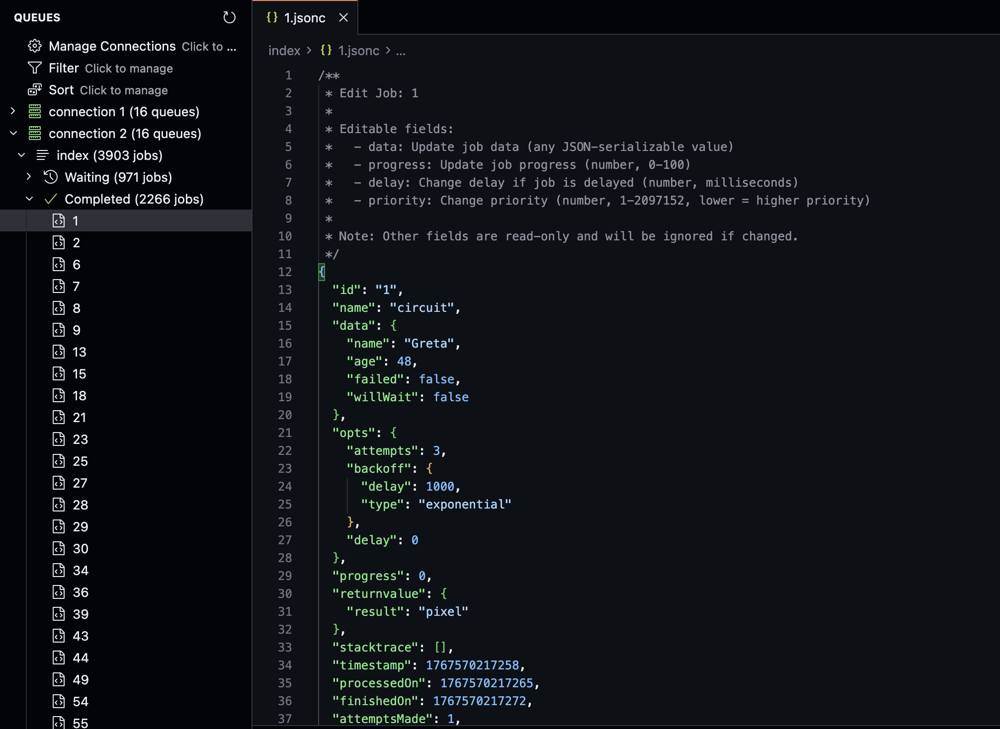

# BullMQ Explorer

Browse and manage [BullMQ](https://docs.bullmq.io/) queues directly from VS Code. Connect to Redis, inspect jobs, and run common queue operations without leaving the editor.



## Features

- **Sidebar view** — Open the **BullMQ Explorer** from the Activity Bar to see all configured Redis connections and their queues.
- **Multiple connections** — Add several Redis instances and switch between them in one place.
- **Autodiscover queues** — The extension will automatically discover queues in the Redis instances and display them in the sidebar.
- **Queue management**
  - **Create Job** — Add a new job to a queue (supports JSON payload).
  - **Drain Queue** — Move all waiting jobs to delayed (or remove them, depending on BullMQ options).
  - **Obliterate Queue** — Remove all queue data (use with care).
- **Job actions**
  - **Show Job Details** — View full job data, options, and progress in the editor.
  - **Edit Job** — Change job data or options.
  - **Remove Job** — Delete a job from the queue.
  - **Promote Job** — Move a delayed job back to waiting.
- **Filter & sort** — Filter jobs by status and sort by id, timestamp, or other fields to find what you need quickly.

## Configuration

Add your Redis connections in Settings (**File > Preferences > Settings**, or `Cmd+,` / `Ctrl+,`) under **BullMQ Explorer Configuration**:

- **`bullmq-explorer.connections`** — Array of connection objects. Each entry can have:
  - `name` — Label shown in the sidebar (e.g. `"Local"`, `"Staging"`).
  - `config` — IOredis client options.

Example in `settings.json`:

```json
{
  "bullmq-explorer.connections": [
    {
      "name": "Local Redis",
      "config": {
        "host": "localhost",
        "port": 6379,
        "password": ""
      }
    },
    {
      "name": "Staging",
      "config": {
        "host": "redis.staging.example.com",
        "port": 6379,
        "password": "your-password"
      }
    }
  ]
}
```

You can also use **Manage Connections** from the BullMQ Explorer view to add or edit connections.

## Usage

1. **Open the view** — Click the BullMQ Explorer icon in the Activity Bar (left side), or run the command **View: Open View…** and choose **BullMQ Explorer**.
2. **Expand a connection** — Click a connection to load its queues.
3. **Expand a queue** — Click a queue to see job status groups (e.g. waiting, active, completed, failed, delayed).
4. **Use context menus** — Right-click a connection, queue, or job for refresh, create job, drain, obliterate, show details, edit, remove, or promote (for delayed jobs).
5. **Filter & sort** — Use the Filter and Sort entries in the tree (or their context menus) to narrow and order the job list.

## Commands

| Command                        | Description                             |
| ------------------------------ | --------------------------------------- |
| **Refresh**                    | Reload the entire BullMQ Explorer tree  |
| **Manage Connections**         | Open or edit Redis connections          |
| **Filter…** / **Clear Filter** | Filter jobs by status or other criteria |
| **Sort…** / **Clear Sort**     | Change how jobs are ordered             |
| **Create Job**                 | Add a new job to the selected queue     |
| **Drain Queue**                | Drain the selected queue                |
| **Obliterate Queue**           | Obliterate the selected queue           |
| **Show Job Details**           | Open full job data in the editor        |
| **Edit Job**                   | Edit job data or options                |
| **Remove Job**                 | Remove the job from the queue           |
| **Promote Job**                | Promote a delayed job to waiting        |

## License

MIT

---

_Icon by [Freepik - Flaticon](https://www.flaticon.com/free-icons/skull)._
